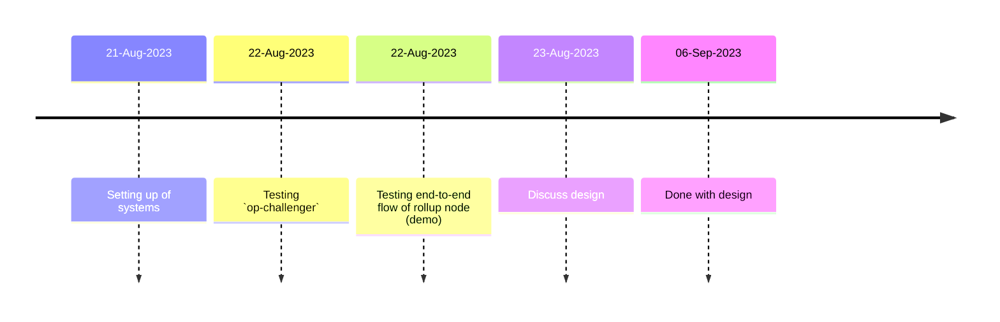

# op-watchtower

> The First Line of Defence for Optimistic Rollups

## Project Timeline

This document entails the project implementation roadmap, goals and our relevant learnings about the OP-Stack. This is likely to update overtime.

## Roadmap

The current goal of this project is to improve our understanding of OP-Stack and implement the first version of the OP-Watchtower.

## Implementation subdivision

### Pankaj

He will be primarily working on implementing the `op-watchtower` using the `op-geth` and `op-challenger` sourcecode as the starting point. A set of his initial tasks are listed (this is not an exhaustive list):

- Setting up the `op-stack` with emphasis on `op-node` and `op-geth`
  - estimate date of completion: by 21st Aug (done)
- Test the working of currently available implementaion of `op-challenger`
  - estimate date of completion: by 22nd Aug
- Verify the end-to-end execution flow of the rolllup node (record demo if possible)
  - estimate date of completion: by 22nd Aug
- Discuss, Design and Implement the `op-watchtower`
  - discussion by 23rd Aug
  - estimate start date : by 23rd Aug
  - estimate date of completion: by 6th Sept

### Senthil

He will be primarily working on implementing additions/changes/integrations to the smart contracts on L1 or L2. Lets assume no asset movement takes place and transactions are placed on L2 through the sequencer.

#### Understanding
- L1
  - L2OutputOracle
    - Estimate Start Date: 24-Aug
    - Estimate End Date: 26-Aug
  
